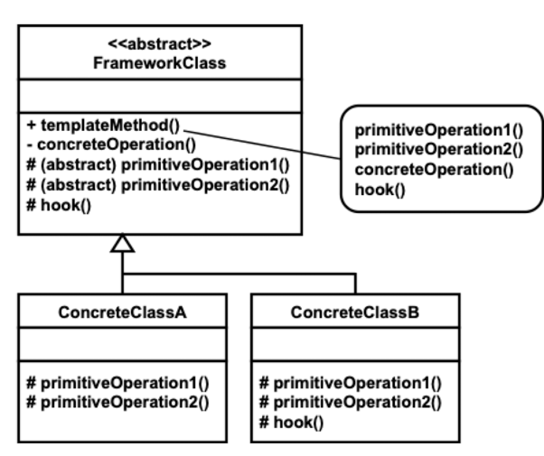

# TemplateMethod 패턴

#### 패턴의 종류
* 행위 패턴

##### 패턴의 목적

> This pattern defines the skeleton of an algorithm in an operation, deferring some steps to subclasses. This pattern
> lets subclasses redefine certain steps of an algorithm without changing the algorithm's structure
> 
> GOF

#### 패턴의 수준
* `component`

#### 패턴의 적용

* 알고리즘에서 변하지 않는 부분은 코드 중복없이 한 번만 구현하고, 변할 수 있는 부분은 하위 클래스가 구현하도록 할 필요가 있을 때
* 하위 클래스들에 나타는 공통 행위에 따른 코드 중복을 줄이고자 할 때
* 하위 클래스의 확장을 제한하고자 할 때

#### 패턴 적용 가능 시나리오

1. 게임에서 유사한 유닛의 행동 알고리즘
2. 일부 스케줄만 차이가 있는 패키지 여행

#### 패턴의 참여자

* 추상 클래스
  * 템플릿 메서드가 정의되어 있고, 자식이 재정의해야 하는 추상 메서드가 정의되어 있는 클래스
  * 상위 클래스의 추상 메서드와 필요한 훅 메서드를 재정의하고 있는 클래스

#### 참여자 간 협력

* 구체적 클래스는 알고리즘이 변하지 않는 부분에 대해서는 추상 클래스에 의존한다.
* 구체적 클래스는 상위 클래스의 메서드르 보통 직접 호출하지 않는다.

#### 패턴의 구현

* 패턴과 연관된 메서드의 종류
  * 템플릿 메서드
    * 추상 클래스에 정의되며, 내부적으로 추상 메서드, 구체 메서드, 훅 메서드를 이용하여 알고리즘의 골격을 구현한다.
    * 하위 클래스에서 재정의 간능하지 않다.
  * 추상 메서드
    * 템플릿 메서드가 완전하게 동작하기 위해 하위 클래스에서 반드시 재정의해야 하는 메서드
  * 훅 메서드
    * 하위 클래스에서 선택적으로 재정의할 수 있는 메서드이다.
    * 템플릿 메서드가 정의된 클래스에 기본적 행동이 구현되어 있어야 한다.
  * 구체 메서드
    * 하위 클래스에서 재정의할 필요가 없는 메서드이다.
    * 보통 하위 클래스에서 재정의하지 못하도록 한다.

* 추상 메서드의 수는 최소화되어야 바람직하다.

### 패턴의 구조

### 패턴의 장단점

#### 장점
* 자식 클래스의 확장을 제한할 수 있다.
* 코드의 중복을 줄일 수 있다.

#### 단점
* 알고리즘의 고정된 골격에 의해 유연성이 떨어질 수 있다.

#### 패턴의 변형

* `is-a` 관계 대신에 `has-a` 관계로 모델링할 수 있다.(Strategy Pattern 형태)
  * 추상 메서드는 전략에 해당하는 객체 메서드를 호출하는 형태로 구현한다.
  * 이 방법에서는 훅 메서드를 활용할 수 없다.
  * 하위 클래스 이름을 통한 구분이 가능하지 않다.

#### 관련 패턴

* 팩토리 메서드 패턴
  * 보통 팩토리 메서드 패턴에서 팩토리 메서드는 템플릿 메서드 형탤 구현한다. 이 패턴은 템플릿 메서드 패턴을 객체 생성에 적용한 패턴이다.
* 전략 패턴
  * 이 패턴은 보통 포함 관계를 사용하여 알고리즘 전체를 바꾸는 패턴이다.

