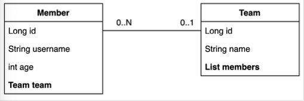
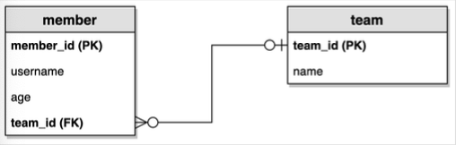

# Querydsl

### Querydsl 설정과 검증

```groovy

buildscript {
    ext {
        queryDslVersion = "5.0.0"
    }
}

plugins {
    id 'org.springframework.boot' version '2.7.2'
    id 'io.spring.dependency-management' version '1.0.12.RELEASE'
    id "com.ewerk.gradle.plugins.querydsl" version "1.0.10"
    id 'java'
}

group = 'study'
version = '0.0.1-SNAPSHOT'
sourceCompatibility = '11'


configurations {
    compileOnly {
        extendsFrom annotationProcessor
    }
}

repositories {
    mavenCentral()
}

dependencies {
    implementation 'org.springframework.boot:spring-boot-starter-thymeleaf'
    implementation 'org.springframework.boot:spring-boot-starter-web'

    //JdbcTemplate 추가
    //implementation 'org.springframework.boot:spring-boot-starter-jdbc'
    //MyBatis 추가
    implementation 'org.mybatis.spring.boot:mybatis-spring-boot-starter:2.2.0'
    //JPA, 스프링 데이터 JPA 추가
    implementation 'org.springframework.boot:spring-boot-starter-data-jpa'

    //Querydsl 추가
    implementation "com.querydsl:querydsl-jpa:${queryDslVersion}"
    implementation "com.querydsl:querydsl-apt:${queryDslVersion}"

    //H2 데이터베이스 추가
    runtimeOnly 'com.h2database:h2'
    compileOnly 'org.projectlombok:lombok'
    annotationProcessor 'org.projectlombok:lombok'
    testImplementation 'org.springframework.boot:spring-boot-starter-test'

    //테스트에서 lombok 사용
    testCompileOnly 'org.projectlombok:lombok'
    testAnnotationProcessor 'org.projectlombok:lombok'
}

clean {
    delete file('src/main/generated')
}

tasks.named('test') {
    useJUnitPlatform()
}

def querydslDir = "$buildDir/generated/querydsl"

querydsl {
    jpa = true
    querydslSourcesDir = querydslDir
}
sourceSets {
    main.java.srcDir querydslDir
}
compileQuerydsl{
    options.annotationProcessorPath = configurations.querydsl
}
configurations {
    compileOnly {
        extendsFrom annotationProcessor
    }
    querydsl.extendsFrom compileClasspath
}
```

### Querydsl 환경설정 검증

검증용 엔티티 생성

```java
package study.querydsl.entity;

import lombok.Getter;
import lombok.Setter;

import javax.persistence.Entity;
import javax.persistence.GeneratedValue;
import javax.persistence.Id;

@Getter
@Setter
@Entity
public class Hello {

    @Id @GeneratedValue
    private Long id;
}
```

#### 검증용 Q 타입 생성

Gradle IntelliJ 사용법

* Gradle -> Tasks -> build -> clean 
* Gradle -> Tasks -> other -> compileQuerydsl


#### QuerydslApplicationTests

```java
package study.querydsl;

import com.querydsl.jpa.impl.JPAQueryFactory;
import org.assertj.core.api.Assertions;
import org.junit.jupiter.api.Test;
import org.springframework.beans.factory.annotation.Autowired;
import org.springframework.boot.test.context.SpringBootTest;
import study.querydsl.entity.Hello;
import study.querydsl.entity.QHello;

import javax.persistence.EntityManager;
import javax.transaction.Transactional;

@SpringBootTest
@Transactional
class QuerydslApplicationTests {

    @Autowired EntityManager em;
    
    @Test
    void contextLoads() {
        Hello hello = new Hello();
        em.persist(hello);

        JPAQueryFactory query = new JPAQueryFactory(em);
        QHello qHello = new QHello("h");

        Hello result = query
                .selectFrom(qHello)
                .fetchOne();

        Assertions.assertThat(result).isEqualTo(hello);
    }
}
```

## 스프링 부트 설정 - JPA, DB

#### application.yml

```yaml
spring:
  datasource:
    url: jdbc:h2:tcp://localhost/~/querydsl
    username: sa
    password:
    driver-class-name: org.h2.Driver
  jpa:
    hibernate:
      ddl-auto: create
    properties:
      hibernate:
        #        show_sql: true
        format_sql: true
logging.level:
  org.hibernate.SQL: debug
#  org.hibernate.type: trace
```

## 예제 도메인 모델과 동작확인

#### 엔티티 클래스




#### ERD




### [Member.java](./src/main/java/study/querydsl/entity/Member.java)

```java
package study.querydsl.entity;

import lombok.AccessLevel;
import lombok.Getter;
import lombok.NoArgsConstructor;

import javax.persistence.*;

@Entity
@Getter
@NoArgsConstructor(access = AccessLevel.PROTECTED)
public class Member {

    @Id @GeneratedValue
    private Long id;

    private String username;
    private int age;

    @ManyToOne(fetch = FetchType.LAZY)
    @JoinColumn(name = "team_id")
    private Team team;

    public Member(String username, int age, Team team) {
        this.username = username;
        this.age = age;
        if(team != null){
            changeTeam(team);
        }
    }

    private void changeTeam(Team team) {
        this.team = team;
        team.getMembers().add(this);
    }
}
```

#### [Team.java](./src/main/java/study/querydsl/entity/Team.java)

```java
package study.querydsl.entity;

import lombok.*;

import javax.persistence.*;
import java.util.ArrayList;
import java.util.List;

@Entity
@Getter @Setter
@NoArgsConstructor(access = AccessLevel.PROTECTED)
@ToString(of = {"id", "name"})
public class Team {

    @Id @GeneratedValue
    @Column(name = "team_id")
    private Long id;

    private String name;

    @OneToMany(mappedBy = "team")
    private List<Member> members = new ArrayList<>();

    public Team(String name) {
        this.name = name;
    }
}
```


#### [데이터 확인 테스트](./src/test/java/study/querydsl/entity/MemberTest.java)

```java
package study.querydsl.entity;

import org.junit.jupiter.api.Test;
import org.springframework.beans.factory.annotation.Autowired;
import org.springframework.boot.test.context.SpringBootTest;
import org.springframework.test.annotation.Commit;

import javax.persistence.EntityManager;
import javax.transaction.Transactional;
import java.util.List;

@SpringBootTest
@Transactional
@Commit
class MemberTest {

    @Autowired
    EntityManager em;

    @Test
    public void testEntity() {
        Team teamA = new Team("teamA");
        Team teamB = new Team("teamB");

        em.persist(teamA);
        em.persist(teamB);

        Member member1 = new Member("member1", 10, teamA);
        Member member2 = new Member("member2", 20, teamA);
        Member member3 = new Member("member3", 30, teamB);
        Member member4 = new Member("member4", 40, teamB);

        em.persist(member1);    
        em.persist(member2);
        em.persist(member3);
        em.persist(member4);

        em.flush();
        em.clear();

        List<Member> members = em.createQuery("select m from Member m", Member.class)
                .getResultList();

        for (Member member : members) {
            System.out.println("member = " + member);
            System.out.println("-> member.team=" + member.getTeam());
        }
    }

}
```

#### 기본 문법

#### 테스트 기본 코드

```java
package study.querydsl;

import com.querydsl.jpa.impl.JPAQueryFactory;
import org.junit.jupiter.api.BeforeEach;
import org.junit.jupiter.api.Test;
import org.springframework.beans.factory.annotation.Autowired;
import org.springframework.boot.test.context.SpringBootTest;
import study.querydsl.entity.Member;
import study.querydsl.entity.QMember;
import study.querydsl.entity.Team;

import javax.persistence.EntityManager;
import javax.transaction.Transactional;

import static org.assertj.core.api.Assertions.*;

@SpringBootTest
@Transactional
public class QuerydslBasicTest {

    @Autowired
    EntityManager em;

    JPAQueryFactory queryFactory;

    @BeforeEach
    public void before(){
        queryFactory = new JPAQueryFactory(em);
        Team teamA = new Team("teamA");
        Team teamB = new Team("teamB");

        em.persist(teamA);
        em.persist(teamB);

        Member member1 = new Member("member1", 10, teamA);
        Member member2 = new Member("member2", 20, teamA);
        Member member3 = new Member("member3", 30, teamB);
        Member member4 = new Member("member4", 40, teamB);

        em.persist(member1);
        em.persist(member2);
        em.persist(member3);
        em.persist(member4);
    }

    @Test
    public void startJPQL(){
        Member findMember = em.createQuery("select m from Member m where m.username = :username", Member.class)
                .setParameter("username", "member1")
                .getSingleResult();

        assertThat(findMember.getUsername()).isEqualTo("member1");
    }

    @Test
    public void startQuerydsl() {
        QMember m = new QMember("m");

        Member findMember = queryFactory
                .select(m)
                .from(m)
                .where(m.username.eq("member1"))
                .fetchOne();

        assertThat(findMember.getUsername()).isEqualTo("member1");
    }
}
```

* `EntityManager` 로 `JPAQueryFactory` 생성 
* Querydsl은 JPQL 빌더 
* JPQL: 문자(실행 시점 오류), Querydsl: 코드(컴파일 시점 오류) 
* JPQL: 파라미터 바인딩 직접, Querydsl: 파라미터 바인딩 자동 처리

* `JPAQueryFactory`를 생성할 때 제공하는 `EntityManager(em)`에 동시성 문제가 달려있다. 
  스프링 프레임워크는 여러 쓰레드에서 동시에 같은 `EntityManager`에 접근해도, 트랜잭션 마다 별도의 영속성 컨텍스트를 제공하기 때문에,
  동시성 문제는 걱정하지 않아도 된다.


## 기본 Q-Type 활용

#### Q클래스 인스턴스를 사용하는 2가지 방법

```java
QMember qMember = new QMember("m"); //별칭 직접 지정 
QMember qMember = QMember.member; //기본 인스턴스 사용
```

#### 기본 인스턴스를 static import와 함께 사용

```java
package study.querydsl;

import com.querydsl.jpa.impl.JPAQueryFactory;
import org.junit.jupiter.api.BeforeEach;
import org.junit.jupiter.api.Test;
import org.springframework.beans.factory.annotation.Autowired;
import org.springframework.boot.test.context.SpringBootTest;
import study.querydsl.entity.Member;
import study.querydsl.entity.QMember;
import study.querydsl.entity.Team;

import javax.persistence.EntityManager;
import javax.transaction.Transactional;

import static org.assertj.core.api.Assertions.assertThat;
import static study.querydsl.entity.QMember.member;

@SpringBootTest
@Transactional
public class QuerydslBasicTest {

    @Autowired
    EntityManager em;

    JPAQueryFactory queryFactory;
    
    @Test
    public void startQuerydsl() {
        Member findMember = queryFactory
                .select(member)
                .from(member)
                .where(member.username.eq("member1"))
                .fetchOne();

        assertThat(findMember.getUsername()).isEqualTo("member1");
    }
}
```

다음 설정을 추가하면 실행되는 JPQL을 볼 수 있다.

```java
spring.jpa.properties.hibernate.use_sql_comments: true
```

> 참고
> 
> 같은 테이블을 조인해야 하는 경우가 아니면 기본 인스턴스를 사용하면 된다.

## 검색 조건 쿼리

#### 기본 검색 쿼리

```java
@Test
void search() {
    Member findMember = queryFactory
            .selectFrom(member)
            .where(member.username.eq("member1")
                    .and(member.age.eq(10)))
            .fetchOne();

    assertThat(findMember.getUsername()).isEqualTo("member1");
}
```

* 검색조건은 .and(),.or()를메서드체인으로연결할수있다.


> 참고
> 
> select , from 을 selectFrom 으로 합칠 수 있음


### JPQL이 제공하는 모든 검색 조건 제공

```java
public class Main{
  public static void main(String[] args) {
    member.username.eq("member1"); // username = 'member1'
    member.username.ne("member1"); // username != 'member1'
    member.username.eq("member1").not(); // username != 'member1'
    
    member.username.isNotNull(); // username is Not NULL
    
    member.age.in(10, 20); // age in (10, 20)
    member.age.notIn(10, 20); // age not in (10, 20)
    member.age.between(10, 30); // age between 10, 30
    
    member.age.goe(30); // age >= 30
    member.age.gt(30); // age > 30
    member.age.loe(30); // age <= 30
    member.age.lt(30); // age < 30
    
    member.username.like("member%"); // like 검색
    member.username.contains("member"); // like '%member%' 검색
    member.username.startWith("member"); // like 'member%' 검색
  }
}
```

#### AND 조건을 파라미터로 처리

```java
@Test
void searchAndParam() {
    Member findMember = queryFactory
            .selectFrom(member)
            .where(
                    member.username.eq("member1"),
                    member.age.eq(10)
            )
            .fetchOne();

    assertThat(findMember.getUsername()).isEqualTo("member1");
}
```

* `where()` 에 파라미터로 검색조건을 추가하면 `AND` 조건이 추가됨 
* 이 경우 `null` 값은 무시 -> 메서드 추출을 활용해서 동적 쿼리를 깔끔하게 만들 수 있음

## 결과 조회

* `fetch()` : 리스트 조회, 데이터 없으면 빈 리스트 반환 
* `fetchOne()` : 단 건 조회 
  * 결과가 없으면 : `null` 
  * 결과가 둘 이상이면 : `com.querydsl.core.NonUniqueResultException` 
* `fetchFirst()` : limit(1).fetchOne()
* `fetchResults()` : 페이징 정보 포함, total count 쿼리 추가 실행 
* `fetchCount()` : count 쿼리로 변경해서 count 수 조회

```java
@Test
void resultFetch() {
        List<Member> fetch = queryFactory
    .selectFrom(member)
    .fetch();

    Member fetchOne = queryFactory
    .selectFrom(member)
    .fetchOne();

    Member fetchFirst = queryFactory
    .selectFrom(member)
    .fetchFirst();

    QueryResults<Member> results = queryFactory
    .selectFrom(member)
    .fetchResults();

    List<Member> content = results.getResults();

    long total = queryFactory
    .selectFrom(member)
    .fetchCount();

    }
```


## 정렬

```java
/**
 * 외원 정렬 순서
 * 회원 나이 내림차순
 * 회원 이름 올림차순
 * 회원 이름이 없으면 마지막에 출력
 */
@Test
void sort() {
    em.persist(new Member(null, 100));
    em.persist(new Member("member5", 100));
    em.persist(new Member("member6", 100));

    List<Member> result = queryFactory
            .selectFrom(member)
            .where(member.age.eq(100))
            .orderBy(member.age.desc(), member.username.asc().nullsLast())
            .fetch();

    assertThat(result.get(0).getUsername()).isEqualTo("member5");
    assertThat(result.get(1).getUsername()).isEqualTo("member6");
    assertThat(result.get(2).getUsername()).isEqualTo(null);
}
```

* `desc()` , `asc()` : 일반 정렬 
* `nullsLast()` , `nullsFirst()` : null 데이터 순서 부여

## 페이징

#### 조회 건수 제한 

```java
@Test
void paging1() {
    List<Member> result = queryFactory
            .selectFrom(member)
            .orderBy(member.username.desc())
            .offset(1)
            .limit(2)
            .fetch();

    assertThat(result.size()).isEqualTo(2);
}
```

#### 전체 조회 수가 필요하면

```java
@Test
void paging2() {
    QueryResults<Member> queryResults = queryFactory
            .selectFrom(member)
            .orderBy(member.username.desc())
            .offset(1)
            .limit(2)
            .fetchResults();

    assertThat(queryResults.getTotal()).isEqualTo(4);
    assertThat(queryResults.getLimit()).isEqualTo(2);
    assertThat(queryResults.getOffset()).isEqualTo(1);
    assertThat(queryResults.getResults().size()).isEqualTo(2);
}
```

> 주의
>
> count 쿼리가 실행되니 성능상 주의!


> 참고
> 
> 페이징 쿼리를 작성할 때, 데이터를 조회하는 쿼리는 여러 테이블을 조인해야 하지만, 
> count 쿼리는 조인이 필요 없는 경우도 있다. 그런데 이렇게 자동화된 count 쿼리는 원본 쿼리와 같이 모두 조인을 해버리기 때문에 성능이 안나올 수 있다. 
> count 쿼리에 조인이 필요없는 성능 최적화가 필요하다면, count 전용 쿼리를 별도로 작성해야 한다.

## 집합

#### 집합 함수

```java
@Test
void aggregation() {
        List<Tuple> result = queryFactory
    .select(
    member.count(),
    member.age.sum(),
    member.age.avg(),
    member.age.max(),
    member.age.min()
    )
    .from(member)
    .fetch();

    Tuple tuple = result.get(0);
    assertThat(tuple.get(member.count())).isEqualTo(4);
}
```

* JPQL이 제공하는 모든 집합 함수를 제공한다. 


#### GroupBy 사용

```java
@Test
void group() {
    List<Tuple> result = queryFactory
            .select(team.name, member.age.avg())
            .from(member)
            .join(member.team, team)
            .groupBy(team.name)
            .fetch();

    Tuple teamA = result.get(0);
    Tuple teamB = result.get(1);

    assertThat(teamA.get(team.name)).isEqualTo("teamA");
    assertThat(teamB.get(team.name)).isEqualTo("teamB");
}
```

`groupBy` , 그룹화된 결과를 제한하려면 `having`

#### groupBy(), having() 예시

```java
    List<Tuple> result = queryFactory
        .select(team.name, member.age.avg())
        .from(member)
        .join(member.team, team)
        .groupBy(team.name)
        .having(item.price.gt(1000))
        .fetch();
```

## 조인 - 기본 조인

### 기본 조인

조인의 기본 문법은 첫 번째 파라미터에 조인 대상을 지정하고, 두 번째 파라미터에 별칭(alias)으로 사용할 Q 타입을 지정하면 된다.

```java
join(조인 대상, 별칭으로 사용할 Q타입)
```

#### 기본 조인

```java
@Test
void join() {
    List<Member> result = queryFactory
            .selectFrom(member)
            .join(member.team, team)
            .where(team.name.eq("teamA"))
            .fetch();

    assertThat(result)
            .extracting("username")
            .containsExactly("member1", "member2");
}
```

* join() , innerJoin() : 내부 조인(inner join)
* leftJoin() : left 외부 조인(left outer join) 
* rightJoin() : rigth 외부 조인(rigth outer join)
* JPQL의 `on`과 성능 최적화를 위한 fetch 조인 제공 세타 조인


### 세타 조인
연관관계가 없는 필드로 조인

```java
/**
 * 세타 조인
 * 회원의 이름이 팀 이름과 같은 회원 조회
 */
@Test
void theta_join() {
    em.persist(new Member("teamA"));
    em.persist(new Member("teamB"));

    List<Member> result = queryFactory
            .select(member)
            .from(member, team)
            .where(member.username.eq(team.name))
            .fetch();

    assertThat(result)
            .extracting("username")
            .containsExactly("teamA", "teamB");
}
```

* from 절에 여러 엔티티를 선택해서 세타 조인 
* 외부 조인 불가능 -> 다음에 설명할 조인 on 을 사용하면 외부 조인 가능


