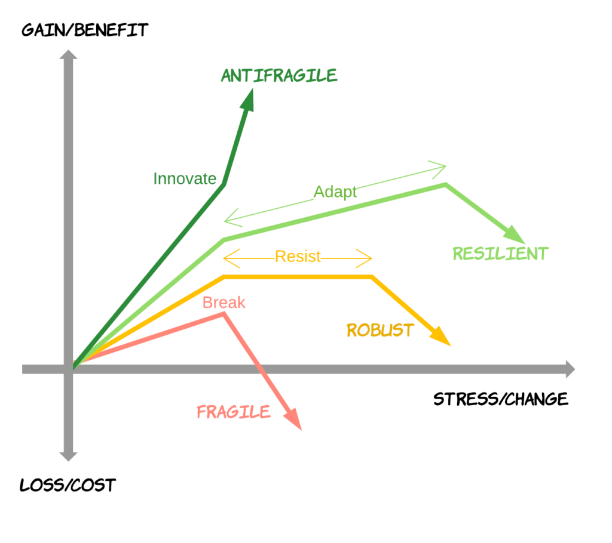
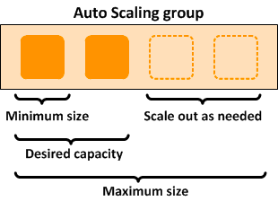
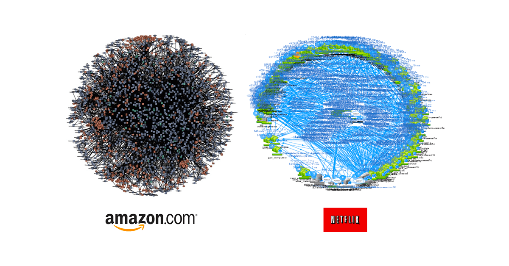

# Microservice와 Spring Cloud

### IT System의 역사

* 1960 ~ 1980s : Fragile, Cowboys
  * 하드웨어가 중심
  * 하드웨어 및 시스템 자체가 고가였기 때문에 서비스의 기능을 수정하거나 변경하기 어려웠다.
  * 깨지기 쉬운 시스템

* 1990 ~ 2000s : Robust, Distributed
  * 분산화된 시스템 덕분에 서비스의 변화가 발생한다고 하더라도 안정성 있고 성능이 높은 서비스를 유지할 수 있게되었다.
  * 시스템이 안정화 됨

* 2010s ~ 현재: Resilient / Anti-Fragile, Cloud Native
  * 클라우드 네이티브로 시스템이 구축됨
  * 시스템이 로컬환경에서 클라우드로 이전됨
  * 확장성과 안정성의 강화

| Domain              | Fragile        | Robust      | Anti-Fragile |
|---------------------|----------------|-------------|--------------|
| Transport           | Racing Car     | Tank, 4x4   | Horse        |
| Transport in London | Train          | Bus         | Bicycle      |
| Market              | stock exchange | Supermarket | Bazaar       |
| Knowledge           | Science book   | Journal     | Wiki         |
| It Culture          | Cowboys        | ITIL        | DevOps       |
| It Architecture     | Monolithic     | Distributed | Cloud Native |

### Antifragile

* Auto scaling
  * 자동 확장성
  * 시스템을 구성하고 있는 인스턴스를 하나의 오토 스케일링 구룹으로 묶어
  * 구룹에서 유지되어야 하는 최소의 인스턴스를 지정할 수 있고
  * 사용량에 따라 자동 인스턴스를 증가할 수 있는 환경

* Microservices
  * 클라우드 네이티브 아키텍처의 핵심
  * 전체 서비스를 구축하고 있는 개별적인 모듈이나 기능을 독립적으로 개발하고 배포하고 운용할 수 있는 세분화된 서비스

* Chaos engineering
  * 예견된 불확실성
  * 예견되지 않는 불확실성
  * 카오스 불확실성

* Continuous deployments
  * 하나의 어플리케이션을 구성하는 서비스를 빌드하고 배포하는 과정을 수동적으로 진행하면 하나의 업무이자 작업 과정이 길어질 수 있다.
  * 이러한 과정을 파이프라이닝 해놓으면 전체적으로 빠르게 대응가능

### Microservice 란?

